# ER Diagram — Smart Meeting & Appointment Management System

> สร้างจาก `prisma/schema.prisma` (สถานะปัจจุบันจริง หลัง migration
> `20260906020941_add_notes_decisions_resources_online_link_participant_source`)
> ครบทั้ง 19 model + 1 implicit join table (`_MeetingGroups`) — 20 ตารางจริงในฐานข้อมูล
>
> เกณฑ์อ่านสัญลักษณ์ (crow's foot, ตามที่ Mermaid ใช้): สัญลักษณ์ที่อยู่ติดกับ entity ฝั่งใด
> บอก "จำนวนของ entity ฝั่งนั้น เมื่อมองจาก 1 แถวของอีกฝั่ง" — `||` = exactly one (FK บังคับ),
> `|o` = zero or one (FK เป็น null ได้), `o{` = zero or many (ฝั่ง many ปกติ), `o|` = zero or one
> (ฝั่ง many แต่มี unique constraint บน FK ทำให้เป็น 1-1 จริง)

---

## 1. Diagram เต็ม (mermaid erDiagram)

```mermaid
erDiagram
    User {
        string id PK
        string email UK "ใช้ login"
        string passwordHash "bcrypt hash"
        string name
        string avatarUrl "nullable"
        string phone "nullable"
        string title "nullable, ตำแหน่ง"
        string department "nullable"
        string role "enum UserRole: ADMIN|MEMBER, default MEMBER"
        boolean emailNotifications "default true"
        boolean inAppNotifications "default true"
        datetime createdAt
        datetime updatedAt
    }

    PasswordResetOtp {
        string id PK
        string userId FK
        string otpHash
        datetime expiresAt
        datetime usedAt "nullable"
        datetime createdAt
    }

    Person {
        string id PK
        string name
        string email UK
        string phone "nullable"
        string avatarUrl "nullable"
        string title "nullable"
        string department "nullable"
        string type "enum PersonType: INTERNAL|EXTERNAL, default EXTERNAL"
        string status "enum PersonStatus: ACTIVE|INACTIVE, default ACTIVE"
        datetime createdAt
        datetime updatedAt
        string userId FK "nullable, UK — ผูกกับ User ถ้าเป็น INTERNAL"
    }

    ContactGroup {
        string id PK
        string name
        string description "nullable"
        string icon "default 'group', ชื่อ material symbol"
        datetime createdAt
        datetime updatedAt
        string createdById FK "nullable"
    }

    ContactGroupMember {
        string id PK
        string groupId FK
        string personId FK
        string role "enum GroupRole: LEADER|MEMBER, default MEMBER"
        datetime joinedAt
    }

    Project {
        string id PK
        string name
        string description "nullable"
        string status "enum ProjectStatus: ACTIVE|PENDING|DELAYED|COMPLETED, default ACTIVE"
        datetime startDate "nullable"
        datetime endDate "nullable"
        datetime createdAt
        datetime updatedAt
        string managerId FK "nullable"
    }

    ProjectMember {
        string id PK
        string projectId FK
        string personId FK
        datetime joinedAt
    }

    OnlineMeetingResource {
        string id PK
        string name
        string url
        string createdById FK "nullable"
        datetime createdAt
        datetime updatedAt
    }

    Meeting {
        string id PK
        string title
        string description "nullable, agenda ตอนนัด (ไม่ใช่ post-meeting notes)"
        string type "enum MeetingType: SINGLE|PROJECT, default SINGLE"
        string status "enum MeetingStatus: PENDING|ACTIVE|COMPLETED|CANCELLED|POSTPONED, default PENDING"
        datetime startTime
        datetime endTime
        string location "nullable, ห้องจริง หรือ raw link"
        datetime createdAt
        datetime updatedAt
        string organizerId FK "nullable, ผู้จัด (User)"
        string organizerPersonId FK "nullable, ผู้จัด (Person)"
        string projectId FK "nullable — BR-06: meeting ไม่จำเป็นต้องอยู่ project"
        string onlineMeetingResourceId FK "nullable — BR-09 ใช้ลิงก์ซ้ำได้"
    }

    MeetingParticipant {
        string id PK
        string meetingId FK
        string personId FK
        string role "enum ParticipantRole: ORGANIZER|ATTENDEE, default ATTENDEE"
        string rsvpStatus "enum RsvpStatus: PENDING|ACCEPTED|DECLINED, default PENDING"
        string source "enum ParticipantSource: DIRECT|GROUP|EXTERNAL, default DIRECT — BR-04"
        string sourceGroupId FK "nullable — กลุ่มต้นทางถ้า source=GROUP"
    }

    MeetingNote {
        string id PK
        string meetingId FK
        string content
        string authorId FK "nullable"
        datetime createdAt
        datetime updatedAt
    }

    Decision {
        string id PK
        string meetingId FK
        string content
        string decidedById FK "nullable"
        datetime decidedAt
        datetime createdAt
    }

    RelatedResource {
        string id PK
        string meetingId FK
        string title
        string url
        string type "enum ResourceType: LINK|DOCUMENT|FILE, default LINK"
        string addedById FK "nullable"
        datetime createdAt
    }

    Task {
        string id PK
        string title
        string description "nullable"
        string status "enum TaskStatus: NOT_STARTED|IN_PROGRESS|COMPLETED, default NOT_STARTED"
        string priority "enum TaskPriority: LOW|MEDIUM|HIGH, default MEDIUM"
        datetime dueDate "nullable"
        datetime createdAt
        datetime updatedAt
        datetime completedAt "nullable"
        string assigneeId FK "nullable (User)"
        string assigneePersonId FK "nullable (Person)"
        string createdById FK "nullable"
        string projectId FK "nullable"
        string meetingId FK "nullable — action item จากประชุมไหน"
    }

    TaskComment {
        string id PK
        string taskId FK
        string authorId FK "nullable"
        string content
        datetime createdAt
    }

    TaskAttachment {
        string id PK
        string taskId FK
        string fileName
        string fileUrl
        int fileSize "bytes"
        string mimeType
        datetime uploadedAt
    }

    Reminder {
        string id PK
        string meetingId FK
        datetime scheduledAt
        string status "enum ReminderStatus: PENDING|SENT|FAILED|CANCELLED, default PENDING"
        string failureReason "nullable"
        datetime sentAt "nullable"
        int retryCount "default 0"
        datetime createdAt
    }

    Notification {
        string id PK
        string userId FK
        string type "enum NotificationType: MEETING_INVITE|MEETING_UPDATED|MEETING_CANCELLED|TASK_ASSIGNED|AI_SUMMARY_READY|REMINDER"
        string title
        string body "nullable"
        boolean isRead "default false"
        string relatedId "nullable, ตีความตาม type"
        datetime createdAt
    }

    AISummary {
        string id PK
        string meetingId FK "UK — 1 meeting มีได้ 1 summary"
        string content
        string sources "nullable, JSON array ของ {label, refType, refId}"
        string model
        boolean isEdited "default false"
        datetime generatedAt
    }

    %% ---- Auth / profile link (1-1) ----
    User |o--o| Person : "profile เดียวกัน (0/1)"

    %% ---- User เป็นเจ้าของ/ผู้สร้าง/ผู้กระทำ (1-many ทั้งหมด, FK nullable) ----
    User ||--o{ PasswordResetOtp : "ขอ OTP"
    User |o--o{ Meeting : "จัด (organizerId)"
    User |o--o{ ContactGroup : "สร้างกลุ่ม"
    User |o--o{ Project : "เป็นผู้จัดการ (managerId)"
    User |o--o{ Task : "รับผิดชอบ (assigneeId)"
    User |o--o{ Task : "สร้างงาน (createdById)"
    User |o--o{ TaskComment : "เขียนคอมเมนต์"
    User ||--o{ Notification : "ได้รับแจ้งเตือน"
    User |o--o{ MeetingNote : "บันทึก note"
    User |o--o{ Decision : "ตัดสินใจ"
    User |o--o{ RelatedResource : "เพิ่ม resource"
    User |o--o{ OnlineMeetingResource : "สร้างลิงก์"

    %% ---- Person เป็นตัวกลางของ contact directory ----
    Person |o--o{ Meeting : "จัด (organizerPersonId, ในฐานะ contact)"
    Person ||--o{ MeetingParticipant : "เข้าร่วม"
    Person ||--o{ ContactGroupMember : "เป็นสมาชิกกลุ่ม"
    Person ||--o{ ProjectMember : "เป็นสมาชิกโปรเจกต์"
    Person |o--o{ Task : "รับผิดชอบ (assigneePersonId)"

    %% ---- Group / Project membership (M:N ผ่าน join entity ที่มีคอลัมน์เพิ่ม) ----
    ContactGroup ||--o{ ContactGroupMember : "มีสมาชิก"
    Project ||--o{ ProjectMember : "มีสมาชิก"

    %% ---- Group ↔ Meeting: many-to-many ตรงๆ (ตาราง join ไม่มีคอลัมน์เสริม) ----
    ContactGroup }o--o{ Meeting : "ถูกเชิญทั้งกลุ่ม (_MeetingGroups)"
    ContactGroup |o--o{ MeetingParticipant : "เป็นแหล่งที่มา (sourceGroupId, BR-04)"

    %% ---- Project → Meeting / Task (1-many, optional ทั้งคู่ตาม BR-06) ----
    Project |o--o{ Meeting : "มีการประชุม"
    Project |o--o{ Task : "มีงาน"

    %% ---- Online link reuse (BR-09/BR-10) ----
    OnlineMeetingResource |o--o{ Meeting : "ถูกใช้ซ้ำได้หลายนัด"

    %% ---- Meeting เป็นศูนย์กลางของ context ทั้งหมด (1-many บังคับ, FK not null) ----
    Meeting ||--o{ MeetingParticipant : "มีผู้เข้าร่วม"
    Meeting ||--o{ Reminder : "มีการแจ้งเตือน"
    Meeting ||--o{ MeetingNote : "มีบันทึกการประชุม"
    Meeting ||--o{ Decision : "มีมติ"
    Meeting ||--o{ RelatedResource : "มีเอกสารอ้างอิง"
    Meeting |o--o{ Task : "สร้าง action item"
    Meeting ||--o| AISummary : "มีสรุป AI (0/1)"

    %% ---- Task ลูกๆ (1-many บังคับ) ----
    Task ||--o{ TaskComment : "มีคอมเมนต์"
    Task ||--o{ TaskAttachment : "มีไฟล์แนบ"
```

---

## 2. ตารางสรุป Relationship ทุกเส้น (1-1 / 1-N / N-N)

| # | Parent (ฝั่ง 1) | Child (ฝั่ง many) | FK อยู่ที่ | Nullable? | ประเภทความสัมพันธ์ | หมายเหตุ |
|---|---|---|---|---|---|---|
| 1 | User | Person | `Person.userId` | ✅ (unique) | **1-1** (optional ทั้งสองฝั่ง) | User เป็น INTERNAL person ก็ได้ ไม่ผูกก็ได้ (external contact ไม่มี User) |
| 2 | User | PasswordResetOtp | `PasswordResetOtp.userId` | ❌ | **1-N** | ผู้ใช้ขอ OTP ได้หลายครั้ง |
| 3 | User | Meeting (organizer) | `Meeting.organizerId` | ✅ | **1-N** | ลบ user แล้ว meeting ไม่หาย (SetNull) |
| 4 | User | ContactGroup | `ContactGroup.createdById` | ✅ | **1-N** | |
| 5 | User | Project (manager) | `Project.managerId` | ✅ | **1-N** | |
| 6 | User | Task (assignee) | `Task.assigneeId` | ✅ | **1-N** | |
| 7 | User | Task (creator) | `Task.createdById` | ✅ | **1-N** | คนละความสัมพันธ์กับ #6 แม้เป็นคู่ entity เดียวกัน |
| 8 | User | TaskComment | `TaskComment.authorId` | ✅ | **1-N** | |
| 9 | User | Notification | `Notification.userId` | ❌ | **1-N** | |
| 10 | User | MeetingNote | `MeetingNote.authorId` | ✅ | **1-N** | |
| 11 | User | Decision | `Decision.decidedById` | ✅ | **1-N** | |
| 12 | User | RelatedResource | `RelatedResource.addedById` | ✅ | **1-N** | |
| 13 | User | OnlineMeetingResource | `OnlineMeetingResource.createdById` | ✅ | **1-N** | |
| 14 | Person | Meeting (organizerPerson) | `Meeting.organizerPersonId` | ✅ | **1-N** | |
| 15 | Person | MeetingParticipant | `MeetingParticipant.personId` | ❌ (`onDelete: Restrict`) | **1-N** | BR-02: ลบ person ที่เคยเข้าประชุมไม่ได้ |
| 16 | Person | ContactGroupMember | `ContactGroupMember.personId` | ❌ | **1-N** | ร่วมกับ #17 ทำให้ Person↔ContactGroup เป็น **N-N** ผ่าน join entity |
| 17 | ContactGroup | ContactGroupMember | `ContactGroupMember.groupId` | ❌ | **1-N** | |
| 18 | Person | ProjectMember | `ProjectMember.personId` | ❌ | **1-N** | ร่วมกับ #19 ทำให้ Person↔Project เป็น **N-N** ผ่าน join entity |
| 19 | Project | ProjectMember | `ProjectMember.projectId` | ❌ | **1-N** | |
| 20 | Person | Task (assigneePerson) | `Task.assigneePersonId` | ✅ | **1-N** | |
| 21 | ContactGroup | Meeting | ตาราง implicit `_MeetingGroups` | — | **N-N** | ไม่มีคอลัมน์เสริม จึงเป็น Prisma implicit join table ล้วนๆ (ต่างจาก ContactGroupMember ที่มี role/joinedAt) |
| 22 | ContactGroup | MeetingParticipant (sourceGroup) | `MeetingParticipant.sourceGroupId` | ✅ | **1-N** | BR-04: บันทึกว่าผู้เข้าร่วมถูกดึงมาจากกลุ่มไหน |
| 23 | Project | Meeting | `Meeting.projectId` | ✅ | **1-N** | BR-06: meeting ไม่จำเป็นต้องอยู่ project |
| 24 | Project | Task | `Task.projectId` | ✅ | **1-N** | |
| 25 | OnlineMeetingResource | Meeting | `Meeting.onlineMeetingResourceId` | ✅ | **1-N** | BR-09: ลิงก์เดียวใช้ซ้ำได้หลาย meeting |
| 26 | Meeting | MeetingParticipant | `MeetingParticipant.meetingId` | ❌ | **1-N** | |
| 27 | Meeting | Reminder | `Reminder.meetingId` | ❌ | **1-N** | BR-11: 1 meeting มีได้หลาย reminder |
| 28 | Meeting | MeetingNote | `MeetingNote.meetingId` | ❌ | **1-N** | FR-11/BR-15 |
| 29 | Meeting | Decision | `Decision.meetingId` | ❌ | **1-N** | FR-13/BR-15 |
| 30 | Meeting | RelatedResource | `RelatedResource.meetingId` | ❌ | **1-N** | FR-12/BR-15 |
| 31 | Meeting | Task | `Task.meetingId` | ✅ | **1-N** | action item เกิดจาก meeting ไหนก็ได้ หรือไม่ผูกเลยก็ได้ |
| 32 | Meeting | AISummary | `AISummary.meetingId` | ❌ (unique) | **1-1** (0 หรือ 1) | BR-18/19/20: summary ไม่แทนที่ notes ต้นฉบับ |
| 33 | Task | TaskComment | `TaskComment.taskId` | ❌ | **1-N** | |
| 34 | Task | TaskAttachment | `TaskAttachment.taskId` | ❌ | **1-N** | |

**สรุปรูปแบบที่เจอ**: 1-1 จริง 2 เส้น (User↔Person, Meeting↔AISummary — ทั้งคู่ทำผ่าน unique FK ไม่ใช่ตาราง join แยก), N-N จริง 1 เส้น (ContactGroup↔Meeting ผ่าน implicit join table), N-N ที่ materialize เป็น entity มีคอลัมน์เสริมอีก 2 คู่ (Person↔ContactGroup ผ่าน ContactGroupMember, Person↔Project ผ่าน ProjectMember), ที่เหลือทั้งหมด 1-N ธรรมดา (ส่วนใหญ่ FK nullable เพราะ business rule อนุญาตให้ไม่ผูกก็ได้ เช่น meeting ไม่ต้องมี project, ไม่ต้องมี online link)
